# houtai_nyedCc 项目文档

> 最后更新：2025-11-09 14:50:39

## 变更记录 (Changelog)

### 2025-11-09 14:50:39
- 初始化项目 AI 上下文文档
- 识别并记录 7 个核心功能模块
- 生成模块架构拓扑图
- 记录数据库结构和核心业务逻辑

---

## 项目愿景

**houtai_nyedCc** 是一个基于 PHP 的后台管理系统，主要用于彩票/游戏类业务管理。系统采用传统的 PHP MVC 架构，集成 Smarty 模板引擎，支持多端访问（PC、移动端），提供用户管理、代理管理、管理员管理、投注管理、开奖管理、报表统计等核心功能。

**技术栈**：
- 后端：PHP（无框架，原生开发）
- 数据库：MySQL（通过自定义 DB 类操作）
- 模板引擎：Smarty 3.x
- 前端：jQuery、Vue.js、AngularJS、Bootstrap
- 辅助库：PHPMailer、PHPExcel、phpqrcode、NuSOAP

---

## 架构总览

### 系统架构特点

1. **分层架构**：
   - 入口层：`index.php`（统一路由入口）
   - 配置层：`data/`（数据库配置、表定义、公共变量）
   - 数据访问层：`global/`（数据库连接、Session、邮件、Excel 等工具类）
   - 业务逻辑层：`func/`（业务函数库）
   - 表现层：`templates/`（Smarty 模板）、`hide/`、`agent/`、`uxj/`、`mxj/`（不同角色入口）

2. **多角色分离**：
   - `hide/`：系统管理员后台
   - `agent/`：代理商后台
   - `uxj/`：PC 端用户前台
   - `mxj/`：移动端用户前台
   - `main/`：公共注册入口

3. **数据库设计**：
   - 表前缀：`x_`（如 `x_user`、`x_order`、`x_kj` 等）
   - 核心表：用户表、订单表、开奖表、投注记录表、资金流水表等
   - 支持触发器机制（订单更新/删除记录到 `x_lib_err` 错误表）

---

## 模块结构图

```mermaid
graph TD
    A["(根) houtai_nyedCc"] --> B["hide - 系统管理员后台"];
    A --> C["agent - 代理商后台"];
    A --> D["uxj - PC用户前台"];
    A --> E["mxj - 移动用户前台"];
    A --> F["func - 业务函数库"];
    A --> G["global - 全局工具库"];
    A --> H["data - 配置与数据层"];
    A --> I["templates - Smarty模板"];
    A --> J["tools - 定时任务/API工具"];
    A --> K["phpqrcode - 二维码库"];
    A --> L["PHPMailer - 邮件库"];

    click B "./hide/CLAUDE.md" "查看 hide 模块文档"
    click C "./agent/CLAUDE.md" "查看 agent 模块文档"
    click D "./uxj/CLAUDE.md" "查看 uxj 模块文档"
    click E "./mxj/CLAUDE.md" "查看 mxj 模块文档"
    click F "./func/CLAUDE.md" "查看 func 模块文档"
    click G "./global/CLAUDE.md" "查看 global 模块文档"
    click H "./data/CLAUDE.md" "查看 data 模块文档"
```



---

## 模块索引

| 模块路径 | 职责描述 | 主要文件 | 语言 |
|---------|---------|---------|------|
| `hide/` | 系统管理员后台（用户管理、订单管理、开奖管理、系统配置） | `login.php`, `suser.php`, `kj.php`, `game.php` | PHP |
| `agent/` | 代理商后台（下级用户管理、报表查看、盈亏统计） | `login.php`, `suser.php`, `report.php`, `account.php` | PHP |
| `uxj/` | PC 端用户前台（投注、查看开奖、账户管理） | `login.php`, `long.php`, `bao.php`, `lib.php` | PHP |
| `mxj/` | 移动端用户前台（响应式投注界面） | `login.php`, `long.php`, `bao.php`, `member.php` | PHP |
| `func/` | 业务函数库（投注逻辑、开奖计算、报表统计） | `func.php`, `csfunc.php`, `userfunc.php`, `malhc.php` | PHP |
| `global/` | 全局工具库（数据库连接、Session、邮件、Excel、图片处理） | `db.inc.php`, `session.class.php`, `PHPExcel.php`, `img.class.php` | PHP |
| `data/` | 配置与数据层（数据库配置、表定义、公共变量） | `config.inc.php`, `db.php`, `comm.inc.php` | PHP |
| `templates/` | Smarty 模板文件（按模块分目录：hide/agent/uxj/mxj） | `*.html` | Smarty HTML |
| `tools/` | 定时任务与 API 工具（自动开奖、采集开奖数据） | `autokjs_ss.php`, `cj_kj.php`, `api123.php` | PHP |
| `phpqrcode/` | 二维码生成库（第三方库） | `phpqrcode.php` | PHP |
| `PHPMailer/` | 邮件发送库（第三方库） | `PHPMailer.php` | PHP |

---

## 运行与开发

### 环境要求

- PHP 5.6+ 或 PHP 7.x
- MySQL 5.5+
- Apache/Nginx（需支持 .htaccess 或配置 URL 重写）
- PHP 扩展：mysqli、gd、mbstring、session

### 本地启动

1. **配置数据库**：
   - 编辑 `data/config.inc.php`，修改数据库连接信息：
     ```php
     $dbHost = "127.0.0.1";
     $dbPort = '55667';
     $dbName = "lhc_oa";
     $dbUser = "lhc_oa";
     $dbPass = "JH4ctk4mJBNxmhw5";
     ```

2. **导入数据库**：
   - 根据 `data/db.php` 中的表定义创建数据库表（未提供 SQL 文件，需根据代码反推表结构）

3. **配置 Web 服务器**：
   - 将项目根目录作为站点根目录
   - 确保 `index.php` 为默认文档

4. **访问入口**：
   - 管理员后台：`http://localhost/hide/`
   - 代理后台：`http://localhost/agent/`
   - PC 用户：`http://localhost/uxj/`
   - 移动用户：`http://localhost/mxj/`

### 默认登录信息

根据 `------.txt` 文件说明，管理员登录的 MD5 密码：
- 密码：`123456`
- MD5（32位小写）：`e10adc3949ba59abbe56e057f20f883e`
- 用户名：`admin`

---

## 测试策略

**当前测试状态**：无自动化测试框架

**推荐测试方案**：
1. 手动功能测试（登录、投注、开奖、报表）
2. 数据库触发器测试（订单更新/删除的记录备份）
3. 多角色权限隔离测试（管理员/代理/用户）
4. 移动端兼容性测试（mxj 模块）

---

## 编码规范

### PHP 编码规范

1. **文件结构**：
   - 每个 PHP 文件开头需引入必要的依赖（config.inc.php、db.php、session.class.php）
   - 使用 `include` 或 `include_once` 引入文件

2. **命名约定**：
   - 表名：`x_` 前缀 + 小写下划线（如 `x_user`、`x_order`）
   - 函数名：小写下划线（如 `getft()`、`rdates()`）
   - 全局变量：`$tb_` 前缀（如 `$tb_user`、`$tb_order`）

3. **安全措施**：
   - 已实现 SQL 注入防护（`acreplace()`、`do_query_safe()`）
   - 已实现 XSS 过滤（对 `$_POST`、`$_GET`、`$_COOKIE` 进行转义）
   - Session 有效期：14400 秒（4 小时）

4. **数据库操作**：
   - 使用自定义 `DB` 类（`$msql`、`$psql` 等对象）
   - 查询方法：`$msql->query()` + `$msql->next_record()` + `$msql->f(字段名)`

### 前端规范

1. **模板引擎**：Smarty 3.x
   - 模板分隔符：`{+` 和 `+}`（自定义）
   - 模板目录：`templates/default/模块名/`

2. **JavaScript**：
   - 使用 jQuery 1.8.3 / 1.11.3
   - 部分模块使用 Vue.js 或 AngularJS
   - 时间选择器：My97DatePicker

---

## AI 使用指引

### 适合 AI 辅助的任务

1. **代码解释与重构**：
   - 解释复杂的业务函数（如 `func/malhc.php` 中的彩票开奖计算逻辑）
   - 重构重复代码（多个模块存在相似的登录、投注逻辑）

2. **安全加固**：
   - 检查 SQL 注入漏洞（虽然有防护，但需要验证覆盖度）
   - 检查 XSS 漏洞（模板输出是否正确转义）
   - 密码存储改进（当前使用 MD5，建议升级到 bcrypt）

3. **数据库优化**：
   - 分析慢查询（如报表统计查询）
   - 索引优化建议

4. **文档生成**：
   - 根据代码自动生成 API 文档
   - 生成数据库表结构文档

### 不适合 AI 修改的部分

1. **核心业务逻辑**：
   - 彩票开奖算法（`func/malhc.php`）
   - 资金流水计算（涉及金钱，需人工审核）

2. **安全敏感配置**：
   - 数据库密码（`data/config.inc.php`）
   - Session 密钥

---

## 关键文件清单

### 核心启动文件
- `/index.php` - 统一路由入口
- `/data/config.inc.php` - 数据库配置
- `/data/db.php` - 表定义与公共函数
- `/global/db.inc.php` - 数据库连接类
- `/global/session.class.php` - Session 管理类

### 业务核心文件
- `/func/func.php` - 通用函数库
- `/func/csfunc.php` - 彩票业务函数
- `/func/malhc.php` - 开奖计算逻辑

### 工具与第三方库
- `/global/PHPExcel.php` - Excel 导入导出
- `/global/img.class.php` - 图片处理（验证码、缩略图）
- `/phpqrcode/phpqrcode.php` - 二维码生成
- `/PHPMailer/PHPMailer.php` - 邮件发送

---

## 注意事项

⚠️ **安全警告**：
1. 本项目代码可能包含安全隐患（MD5 密码、旧版 PHP、缺少 CSRF 防护）
2. 仅供学习研究使用，不建议用于生产环境
3. 部分代码涉及敏感业务（彩票、资金），请遵守当地法律法规

⚠️ **代码质量**：
1. 缺少代码注释（大部分函数无文档说明）
2. 缺少错误处理（部分函数无异常捕获）
3. 缺少单元测试
4. 存在代码重复（多个模块的登录逻辑相似）

---

## 下一步建议

### 短期优化（1-2 周）
1. ✅ 为核心模块生成详细文档（hide、agent、uxj、mxj、func、global、data）
2. 📝 整理数据库表结构文档（反推 SQL DDL）
3. 🔒 安全审计：SQL 注入、XSS、CSRF、弱密码

### 中期优化（1-2 月）
1. 🧪 引入单元测试框架（PHPUnit）
2. 🛠️ 代码重构：提取公共函数、消除重复代码
3. 📊 性能优化：数据库查询优化、缓存机制（Redis/Memcached）

### 长期规划（3-6 月）
1. 🏗️ 框架迁移：考虑迁移到 Laravel 或 ThinkPHP
2. 🔐 密码升级：从 MD5 迁移到 bcrypt
3. 📱 前端现代化：Vue.js 或 React 重构前端
4. 🐳 容器化部署：Docker + Nginx + MySQL

---

**文档版本**：v1.0
**生成工具**：Claude AI
**最后更新**：2025-11-09 14:50:39
