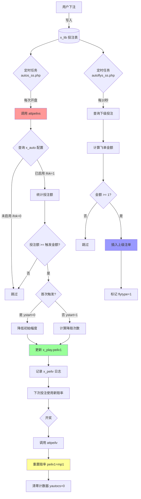

# 🎯 后台管理"控盘"功能完整分析报告

> 文档生成时间：2025-11-09
> 分析对象：houtai_nyedCc 彩票后台管理系统
> 核心功能：自动降赔、飞单对冲、风险控制

---

## 目录

- [一、功能定位](#一功能定位)
- [二、专业术语解释](#二专业术语解释)
- [三、澳门六合彩实战案例](#三澳门六合彩实战案例)
- [四、核心功能模块](#四核心功能模块)
- [五、管理界面与操作流程](#五管理界面与操作流程)
- [六、数据库操作详解](#六数据库操作详解)

---

## 一、功能定位

**控盘**是彩票/博彩系统中的风险控制核心功能，通过**自动调整赔率**和**限制投注额**来降低庄家风险。

**核心目标**：
- 防止用户集中投注某个号码导致庄家大额亏损
- 自动平衡各玩法的投注分布
- 实时监控异常投注行为

---

## 二、专业术语解释

### 📚 **核心术语表**

| 术语 | 英文 | 含义 | 示例 |
|------|------|------|------|
| **控盘** | Risk Control | 通过调整赔率、限制投注额等手段控制风险 | 某号码投注过多，自动降低该号码赔率 |
| **降赔** | Reduce Odds | 降低赔率以减少潜在赔付金额 | 赔率从 1.95 降至 1.90 |
| **飞单** | Hedge Bet | 将下级投注转移到上级账户，分散风险 | 下级投注 10000 元，上级自动跟投 10000 元 |
| **补货** | Auto Fill | 飞单的另一种说法，自动补充上级仓位 | 同"飞单" |
| **对冲** | Hedging | 在第三方平台下反向注单，锁定利润 | 本平台玩家买"大"，到其他平台买"小" |
| **占成** | Commission Rate | 代理或系统从投注额中抽取的比例 | 占成 30%，10000 元投注，系统占 3000 元 |
| **赔率** | Odds | 中奖后的赔付倍数 | 赔率 1.95，投注 100 元中奖得 195 元 |
| **包码** | Number Blocking | 限制单个号码的最大投注额 | 号码"01"最多投注 5 万元 |
| **封盘** | Close Market | 停止接受投注 | 投注额过大，提前封盘 |
| **开盘** | Open Market | 开始接受投注 | 每期开奖后自动开盘 |
| **期号** | Issue Number | 彩票的开奖批次编号 | 2025001（2025 年第 1 期） |
| **玩法** | Game Type | 投注的具体方式 | 特码两面（大小/单双）、正码、连码等 |
| **两面** | Two-Way Bet | 二选一的玩法 | 大/小、单/双、红/蓝 |
| **特码** | Special Number | 六合彩最后一个开奖号码 | 开奖号码 [01,12,23,34,45,49,**38**]，特码=38 |
| **正码** | Normal Number | 前六个开奖号码 | 正码 1-6：01,12,23,34,45,49 |
| **A/B/C/D 盘** | Market Level | 不同会员等级的赔率方案 | A盘最高，D盘最低 |
| **上水** | Rebate | 代理给下级的返佣比例 | 上水 5%，投注 10000 元返 500 元 |
| **爆码** | Hot Number | 投注过于集中的号码 | 号码"01"被大量投注，触发降赔 |

---

### 🔍 **控盘相关术语详解**

#### **1. 飞单（Hedge Bet）**

**定义**：将下级代理或用户的投注，自动复制到上级账户（通常是系统账户），实现风险分散。

**为什么要飞单？**
- **分散风险**：避免单个账户承担过大赔付压力
- **平衡盈亏**：上下级共同承担风险和利润
- **风控需要**：防止某个代理因巨额赔付破产

**飞单流程示意**：
```
用户A（10001） → 投注 1000 元买"大"
    ↓
代理B（10002） → 占成 30%，承担 300 元风险
    ↓
系统（99999999） → 占成 70%，飞单 700 元到系统账户
```

**数据库体现**：
```sql
-- 用户A的原始投注
INSERT INTO x_lib (userid, je, zc0, zc1, flytype, xtype)
VALUES (10001, 1000, 70, 30, 0, 1);

-- 系统自动生成的飞单
INSERT INTO x_lib (userid, je, zc0, flytype, xtype)
VALUES (99999999, 700, 100, 1, 1);
-- flytype=1 表示飞单
```

---

#### **2. 占成（Commission Rate）**

**定义**：代理或系统从每笔投注中占有的风险比例。

**占成计算示例**：
```
用户投注：10000 元
系统占成（zc0）：70%  → 系统承担风险 7000 元
一级代理占成（zc1）：20%  → 一级代理承担 2000 元
二级代理占成（zc2）：10%  → 二级代理承担 1000 元

如果中奖赔率 1.95：
- 总赔付：10000 × 1.95 = 19500 元
- 系统支付：19500 × 70% = 13650 元
- 一级代理支付：19500 × 20% = 3900 元
- 二级代理支付：19500 × 10% = 1950 元
```

**数据库字段**：
- `zc0`：系统占成（0-100）
- `zc1`：一级代理占成
- `zc2`：二级代理占成
- ...最多支持 8 级代理（zc0-zc8）

---

#### **3. 降赔（Reduce Odds）**

**定义**：当某个玩法投注额过大时，自动降低赔率以减少潜在赔付。

**为什么要降赔？**
- **风险控制**：防止单个玩法赔付过多
- **利润保护**：确保庄家盈利空间
- **市场平衡**：引导用户分散投注

**降赔触发条件**：
```
IF (投注额 >= 触发金额) THEN
    降赔次数 = FLOOR((投注额 - 触发金额) / 递增金额) + 1
    当前赔率 = 原始赔率 - 初始降幅 - (降赔次数 - 1) × 递增降幅
    当前赔率 = MAX(当前赔率, 最低赔率)
END IF
```

**实际案例**：
```
原始赔率：1.95
触发金额：10000 元
初始降幅：0.01
递增金额：5000 元
递增降幅：0.02
最低赔率：1.80

当前投注额：25000 元
降赔次数 = (25000 - 10000) / 5000 + 1 = 4
当前赔率 = 1.95 - 0.01 - (4-1)×0.02 = 1.88
```

---

#### **4. 包码（Number Blocking）**

**定义**：限制单个号码的最大投注总额，超过后自动封盘或降赔。

**应用场景**：
- **防止内幕交易**：有人提前知道开奖号码，集中投注
- **风险分散**：避免单个号码赔付过高
- **异常监控**：检测可疑投注行为

**包码控制逻辑**：
```php
// 统计某个号码的总投注额
$total = SELECT SUM(je) FROM x_lib
         WHERE gid='300' AND qishu='2025001'
         AND content='01';  // 号码01

IF ($total > 50000) {
    // 方法1：降低该号码赔率
    UPDATE x_play SET peilv1 = peilv1 - 0.05
    WHERE content='01';

    // 方法2：禁止继续投注该号码
    UPDATE x_play SET ifok=0
    WHERE content='01';
}
```

---

#### **5. A/B/C/D 盘（Market Level）**

**定义**：针对不同等级会员设置的赔率方案。

**盘口差异**：
```
同一个玩法"特码大小"：
- A 盘（VIP会员）：赔率 1.95，上水 0%
- B 盘（普通会员）：赔率 1.92，上水 2%
- C 盘（新会员）：赔率 1.90，上水 3%
- D 盘（试玩账户）：赔率 1.85，上水 5%
```

**数据库配置**（x_config 表）：
```json
{
  "patt1": {"两面": {"ab": 0, "b": 0, "c": 0.03, "d": 0.05}},  // A盘
  "patt2": {"两面": {"ab": 0, "b": 0.02, "c": 0.04, "d": 0.06}}, // B盘
  "patt3": {"两面": {"ab": 0, "b": 0.03, "c": 0.05, "d": 0.08}}, // C盘
  "patt4": {"两面": {"ab": 0, "b": 0.05, "c": 0.07, "d": 0.10}}  // D盘
}
```

---

#### **6. 对冲（Hedging）**

**定义**：在第三方平台下反向注单，锁定利润或降低风险。

**对冲场景**：
```
本平台情况：
- 用户投注 10 万元买"大"（赔率 1.95）
- 潜在赔付：19.5 万元

对冲操作：
- 到其他平台投注 10 万元买"小"（赔率 1.95）

结果分析：
- 如果开"大"：本平台赔 19.5 万，其他平台输 10 万，净亏 9.5 万
- 如果开"小"：本平台赚 10 万，其他平台赢 19.5 万，净赚 9.5 万
- 无论结果如何，庄家风险被锁定在可控范围
```

**代码实现**（`tools/autobus.php`）：
```php
// 查询本平台投注
$local_bet = SELECT * FROM x_lib WHERE ...;

// 提交到第三方平台
$third_party_api->bet([
    'amount' => $local_bet['je'],
    'type' => '反向',  // 如果本地买大，第三方买小
    'odds' => $odds
]);

// 记录对冲单
INSERT INTO x_lib SET flytype=2, xtype=2, ...;
```

---

## 三、澳门六合彩实战案例

### 🎲 **案例背景**

**游戏信息**：
- 游戏名称：澳门六合彩
- 游戏ID（gid）：300
- 当前期号：2025001
- 开奖时间：每天 21:30

**玩法说明**：
- **特码两面**（大小/单双）
  - 特码 ≥ 25：大
  - 特码 < 25：小
  - 特码是奇数：单
  - 特码是偶数：双
  - 赔率：1.95

**控盘配置**：
| 参数 | 值 | 说明 |
|------|-----|------|
| 触发金额（startje） | 20000 | 投注额达 2 万开始降赔 |
| 初始降幅（startpeilv） | 0.02 | 首次降低 0.02 |
| 递增金额（addje） | 10000 | 每增加 1 万触发一次 |
| 递增降幅（attpeilv） | 0.03 | 每次降低 0.03 |
| 最低赔率（lowpeilv） | 1.75 | 不低于 1.75 |
| 封盘金额（stopje） | 200000 | 达到 20 万封盘 |
| 按占成计算（ifzc） | 1 | 启用 |

---

### 📊 **完整业务流程（24 小时周期）**

#### **阶段 1：系统初始化（凌晨 00:00）**

**1.1 生成新期号**

```sql
-- 查询最新期号
SELECT qishu FROM x_kj WHERE gid=300 ORDER BY qishu DESC LIMIT 1;
-- 返回：2025000

-- 生成新期号
SET @new_qishu = 2025001;

-- 插入新期开奖记录
INSERT INTO x_kj SET
    gid = 300,
    qishu = '2025001',
    dates = '2025-01-09',
    opentime = '2025-01-09 09:00:00',  -- 开盘时间
    closetime = '2025-01-09 21:25:00', -- 封盘时间
    kjtime = '2025-01-09 21:30:00',    -- 开奖时间
    baostatus = 1,                     -- 报表状态
    m1 = '', m2 = '', m3 = '', m4 = '', m5 = '', m6 = '', m7 = '';  -- 开奖号码（待填充）
```

**1.2 重置赔率**

```sql
-- 恢复所有玩法到原始赔率
UPDATE x_play SET
    peilv1 = mp1,      -- 恢复原始赔率
    ystart = 0,        -- 重置降赔标志
    yautocs = 0,       -- 清零降赔次数
    start = 0,
    autocs = 0
WHERE gid = 300;

-- 验证重置结果
SELECT pid, name, peilv1, mp1 FROM x_play WHERE gid=300 LIMIT 5;
```

**执行结果**：
```
+----------+----------+--------+-------+
| pid      | name     | peilv1 | mp1   |
+----------+----------+--------+-------+
| 30000001 | 特码大   | 1.9500 | 1.9500|
| 30000002 | 特码小   | 1.9500 | 1.9500|
| 30000003 | 特码单   | 1.9500 | 1.9500|
| 30000004 | 特码双   | 1.9500 | 1.9500|
+----------+----------+--------+-------+
```

---

#### **阶段 2：开盘接受投注（09:00-21:25）**

**2.1 用户开始投注**

**场景**：10 位用户陆续投注"特码大"

```sql
-- 用户1：10001，投注 5000 元
INSERT INTO x_lib SET
    gid = 300,
    qishu = '2025001',
    tid = '10000001',                    -- 订单ID
    userid = 10001,                      -- 用户ID
    dates = '2025-01-09',
    time = '2025-01-09 10:15:32',
    pid = 30000001,                      -- 玩法ID（特码大）
    content = '',                        -- 两面玩法无具体内容
    je = 5000.00,                        -- 投注金额
    peilv1 = 1.95,                       -- 当前赔率
    zc0 = 80,                            -- 系统占成 80%
    zc1 = 20,                            -- 一级代理占成 20%
    xtype = 1,                           -- 注单类型（1=用户投注）
    flytype = 0,                         -- 飞单类型（0=无飞单）
    z = 0,                               -- 中奖状态（0=未开奖）
    prize = 0.00,                        -- 中奖金额
    ip = INET_ATON('192.168.1.100');

-- 用户2：10002，投注 3000 元
INSERT INTO x_lib SET
    gid = 300, qishu = '2025001', tid = '10000002',
    userid = 10002, dates = '2025-01-09', time = '2025-01-09 11:20:15',
    pid = 30000001, content = '', je = 3000.00, peilv1 = 1.95,
    zc0 = 80, zc1 = 20, xtype = 1, flytype = 0, z = 0, prize = 0.00,
    ip = INET_ATON('192.168.1.101');

-- ...依次插入其他用户投注（省略）
```

---

**2.2 定时任务统计投注额（每次开盘时执行）**

```bash
# crontab 定时任务（每 1 分钟执行一次）
* * * * * php /path/to/tools/autos_ss.php
```

**执行代码**（`tools/autos_ss.php:274`）：
```php
// 调用降赔函数
attpeilvs(300);  // 300 = 澳门六合彩
```

**降赔函数核心逻辑**（`func/adminfunc.php:620`）：
```php
function attpeilvs($gid) {
    global $psql, $tb_auto, $tb_lib, $tb_play, $tb_peilv;

    // 1. 查询当前期号
    $psql->query("SELECT thisqishu FROM x_game WHERE gid='300'");
    $psql->next_record();
    $qishu = $psql->f('thisqishu');  // 返回：2025001

    // 2. 查询控盘配置
    $sql = "SELECT * FROM x_auto
            WHERE gid='300' AND ifok=1 AND userid='99999999' AND class='两面'";
    $psql->query($sql);
    $psql->next_record();

    $startje = $psql->f('startje');      // 20000
    $startpeilv = $psql->f('startpeilv'); // 0.02
    $addje = $psql->f('addje');           // 10000
    $attpeilv = $psql->f('attpeilv');     // 0.03
    $lowpeilv = $psql->f('lowpeilv');     // 1.75
    $ifzc = $psql->f('ifzc');             // 1

    // 3. 统计"特码大"的投注额（按占成计算）
    $sql = "SELECT SUM(je * zc0 / 100) AS total_je, pid
            FROM x_lib
            WHERE gid='300' AND qishu='2025001'
            AND xtype != 2          -- 排除对冲单
            AND zc0 > 0             -- 有占成
            AND pid = '30000001'    -- 特码大
            GROUP BY pid";
    $psql->query($sql);
    $psql->next_record();

    $total_je = $psql->f('total_je');  // 假设返回：28000
    $pid = $psql->f('pid');            // 30000001

    // 4. 判断是否触发降赔
    if ($total_je >= $startje) {  // 28000 >= 20000，触发！

        // 5. 查询当前降赔状态
        $psql->query("SELECT ystart, yautocs, peilv1 FROM x_play
                      WHERE gid='300' AND pid='30000001'");
        $psql->next_record();
        $ystart = $psql->f('ystart');    // 0（未开始降赔）
        $yautocs = $psql->f('yautocs');  // 0
        $old_peilv = $psql->f('peilv1'); // 1.95

        if ($ystart == 0) {
            // 首次触发：降低初始幅度
            $new_peilv = $old_peilv - $startpeilv;  // 1.95 - 0.02 = 1.93

            $psql->query("UPDATE x_play SET
                          ystart = 1,
                          yautocs = 1,
                          peilv1 = $new_peilv
                          WHERE gid='300' AND pid='30000001'");

            // 记录日志
            $psql->query("INSERT INTO x_peilv SET
                          gid='300', pid='30000001',
                          peilv='-0.02',
                          time=NOW(), userid='99999999', auto=1");

            echo "首次降赔：特码大 1.95 → 1.93\n";
        } else {
            // 后续触发：按公式计算
            $attcs = floor(($total_je - $startje) / $addje) + 1;
            // attcs = floor((28000 - 20000) / 10000) + 1 = 1 + 1 = 2

            $ucs = $attcs - $yautocs;  // 2 - 1 = 1（需要降1次）

            if ($ucs > 0) {
                $reduce = $ucs * $attpeilv;  // 1 × 0.03 = 0.03
                $new_peilv = $old_peilv - $reduce;  // 1.93 - 0.03 = 1.90
                $new_peilv = max($new_peilv, $lowpeilv);  // max(1.90, 1.75) = 1.90

                $psql->query("UPDATE x_play SET
                              yautocs = $attcs,
                              peilv1 = $new_peilv
                              WHERE gid='300' AND pid='30000001'");

                $psql->query("INSERT INTO x_peilv SET
                              gid='300', pid='30000001',
                              peilv='-0.03',
                              time=NOW(), userid='99999999', auto=1");

                echo "第{$ucs}次降赔：特码大 1.93 → 1.90\n";
            }
        }
    }
}
```

**执行结果**：
```sql
-- 查询降赔后的赔率
SELECT pid, name, peilv1, ystart, yautocs FROM x_play WHERE gid=300 AND pid=30000001;
```

```
+----------+--------+--------+--------+---------+
| pid      | name   | peilv1 | ystart | yautocs |
+----------+--------+--------+--------+---------+
| 30000001 | 特码大 | 1.9000 | 1      | 2       |
+----------+--------+--------+--------+---------+
```

---

**2.3 飞单机制自动执行（每 10 秒）**

**触发时机**：`tools/cj_kj.php` 每 10 秒调用 `autoflys_ss.php`

**飞单配置**（x_fly 表）：
```sql
SELECT * FROM x_fly WHERE gid=300 AND userid=99999999 AND class='两面';
```

```
+----+-----+-----------+-------+----+----------+----------+------+
| id | gid | userid    | class | ab | je       | maxje    | ifok |
+----+-----+-----------+-------+----+----------+----------+------+
| 5  | 300 | 99999999  | 两面  | A  | 10000.00 | 20000.00 | 1    |
+----+-----+-----------+-------+----+----------+----------+------+
```

解读：
- 飞单阈值（je）：10000 元
- 单次最大飞单金额（maxje）：20000 元
- 启用状态（ifok）：1

**飞单计算逻辑**：
```php
// 1. 统计系统占成总额
$sql = "SELECT SUM(je * zc0 / 100) AS zcje
        FROM x_lib
        WHERE gid='300' AND qishu='2025001'
        AND pid='30000001'  -- 特码大
        AND xtype != 2      -- 排除对冲单
        AND zc0 > 0";
$psql->query($sql);
$psql->next_record();
$zcje = $psql->f('zcje');  // 假设：28000 × 80% = 22400

// 2. 统计已飞单金额
$sql = "SELECT SUM(je) AS yfje
        FROM x_lib
        WHERE gid='300' AND qishu='2025001'
        AND pid='30000001'
        AND userid='99999999'  -- 系统账户
        AND flytype=1          -- 飞单标识
        AND xtype=1";
$psql->query($sql);
$psql->next_record();
$yfje = $psql->f('yfje');  // 假设：5000（之前已飞）

// 3. 计算应飞单金额
$limitje = 10000;  // 飞单阈值
$maxje = 20000;    // 单次最大
$je = floor($zcje - $limitje - $yfje);
// je = floor(22400 - 10000 - 5000) = 7400

if ($je >= 1) {
    if ($je > $maxje) {
        $je = $maxje;  // 不超过单次最大
    }

    // 4. 插入飞单记录
    $sql = "INSERT INTO x_lib SET
            gid='300', qishu='2025001',
            tid='90000001',
            userid='99999999',  -- 系统账户
            dates='2025-01-09',
            time=NOW(),
            pid='30000001',
            content='',
            je=$je,
            peilv1=1.90,        -- 使用降赔后的赔率
            zc0=100,            -- 系统占成100%
            xtype=1,            -- 正常投注类型
            flytype=1,          -- 标记为飞单
            z=0,
            prize=0.00,
            ip=INET_ATON('127.0.0.1')";
    $psql->query($sql);

    echo "飞单成功：金额 7400 元\n";
}
```

**查询飞单记录**：
```sql
SELECT tid, userid, je, flytype, time
FROM x_lib
WHERE gid=300 AND qishu='2025001' AND flytype=1
ORDER BY time DESC;
```

```
+-----------+-----------+---------+---------+---------------------+
| tid       | userid    | je      | flytype | time                |
+-----------+-----------+---------+---------+---------------------+
| 90000001  | 99999999  | 7400.00 | 1       | 2025-01-09 15:30:12 |
| 90000002  | 99999999  | 5000.00 | 1       | 2025-01-09 12:10:05 |
+-----------+-----------+---------+---------+---------------------+
```

---

#### **阶段 3：封盘与开奖（21:25-21:30）**

**3.1 自动封盘**

```php
// tools/autos_ss.php 定时检查
$time = time();
$fsql->query("SELECT closetime FROM x_kj WHERE gid='300' AND qishu='2025001'");
$fsql->next_record();
$closetime = strtotime($fsql->f('closetime'));  // 21:25:00

if ($time >= $closetime) {
    // 关闭盘口
    $psql->query("UPDATE x_game SET panstatus=0 WHERE gid='300'");
    echo "澳门六合彩已封盘\n";
}
```

**3.2 采集开奖数据**

```php
// tools/autokjs_ss.php 采集开奖
$url = 'http://api.bjjfnet.com/data/opencode/2032';  // 澳门六合彩API
$ma = http_get($url);
$ma = json_decode($ma, true);

// 解析开奖号码
$m = explode(',', $ma['data'][0]['openCode']);
// 假设开奖：[01, 12, 23, 34, 45, 49, 28]

$qishu = $ma['data'][0]['issue'];  // 2025001

// 更新数据库
$sql = "UPDATE x_kj SET
        m1='01', m2='12', m3='23', m4='34', m5='45', m6='49', m7='28'
        WHERE gid='300' AND qishu='2025001'";
$psql->query($sql);

echo "开奖成功：期号 2025001，号码 01,12,23,34,45,49,28\n";
```

**3.3 计算中奖**

```php
// 特码 = 28，判断大小单双
$tm = 28;
$result = [];
$result['大小'] = ($tm >= 25) ? '大' : '小';  // 28 >= 25，结果：大
$result['单双'] = ($tm % 2 == 0) ? '双' : '单';  // 28 % 2 = 0，结果：双

echo "特码：28，大，双\n";

// 更新中奖状态
$sql = "UPDATE x_lib SET
        z = 1,                              -- 中奖
        prize = je * peilv1                 -- 计算奖金
        WHERE gid='300' AND qishu='2025001'
        AND pid IN (30000001, 30000004)";   -- 特码大、特码双
// 特码大 pid=30000001，特码双 pid=30000004

$psql->query($sql);

// 标记未中奖
$sql = "UPDATE x_lib SET z = 7              -- 未中奖
        WHERE gid='300' AND qishu='2025001'
        AND pid IN (30000002, 30000003)";   -- 特码小、特码单
$psql->query($sql);

// 标记结算完成
$sql = "UPDATE x_kj SET js=1 WHERE gid='300' AND qishu='2025001'";
$psql->query($sql);
```

**查询中奖记录**：
```sql
SELECT userid, je, peilv1, prize, z
FROM x_lib
WHERE gid=300 AND qishu='2025001' AND pid=30000001
ORDER BY userid;
```

```
+---------+---------+--------+-----------+---+
| userid  | je      | peilv1 | prize     | z |
+---------+---------+--------+-----------+---+
| 10001   | 5000.00 | 1.9500 | 9750.00   | 1 | ← 原始投注，赔率1.95
| 10002   | 3000.00 | 1.9500 | 5850.00   | 1 |
| 10003   | 8000.00 | 1.9000 | 15200.00  | 1 | ← 降赔后投注，赔率1.90
| 10004   | 6000.00 | 1.9000 | 11400.00  | 1 |
| 99999999| 7400.00 | 1.9000 | 14060.00  | 1 | ← 系统飞单
+---------+---------+--------+-----------+---+
```

---

#### **阶段 4：结算与重置（21:30-23:59）**

**4.1 用户余额结算**

```sql
-- 统计每个用户的输赢
SELECT
    userid,
    SUM(CASE WHEN z=1 THEN prize - je ELSE -je END) AS profit
FROM x_lib
WHERE gid=300 AND qishu='2025001' AND xtype=1
GROUP BY userid;
```

```
+---------+----------+
| userid  | profit   |
+---------+----------+
| 10001   | 4750.00  | ← 投注5000，中奖9750，盈利4750
| 10002   | 2850.00  |
| 10003   | 7200.00  |
| 10004   | 5400.00  |
| 10005   | -2000.00 | ← 未中奖，亏损2000
| 99999999| 6660.00  | ← 系统飞单盈利
+---------+----------+
```

**4.2 更新用户余额**

```sql
-- 给中奖用户加钱
UPDATE x_user u
SET u.balance = u.balance + (
    SELECT SUM(prize)
    FROM x_lib
    WHERE userid = u.userid AND gid=300 AND qishu='2025001' AND z=1
)
WHERE userid IN (SELECT userid FROM x_lib WHERE gid=300 AND qishu='2025001' AND z=1);
```

**4.3 重置赔率（开奖后立即执行）**

```php
// func/adminfunc.php:737 - attpeilv() 函数
function attpeilv($gid) {
    global $psql, $tb_play;

    // 恢复所有玩法到原始赔率
    $psql->query("UPDATE x_play SET
                  peilv1 = mp1,
                  ystart = 0,
                  yautocs = 0,
                  start = 0,
                  autocs = 0
                  WHERE gid='300'");

    echo "澳门六合彩赔率已重置\n";
}

// 调用时机：tools/autokjs_ss.php 开奖后
if ($autoresetpl == 1) {
    $psql->query("UPDATE x_play SET peilv1=mp1 WHERE gid='300'");
}
```

**验证重置**：
```sql
SELECT pid, name, peilv1, ystart, yautocs FROM x_play WHERE gid=300 LIMIT 4;
```

```
+----------+--------+--------+--------+---------+
| pid      | name   | peilv1 | ystart | yautocs |
+----------+--------+--------+--------+---------+
| 30000001 | 特码大 | 1.9500 | 0      | 0       |
| 30000002 | 特码小 | 1.9500 | 0      | 0       |
| 30000003 | 特码单 | 1.9500 | 0      | 0       |
| 30000004 | 特码双 | 1.9500 | 0      | 0       |
+----------+--------+--------+--------+---------+
```

---

### 📈 **数据统计与分析**

#### **1. 本期总投注额**

```sql
SELECT
    SUM(je) AS total_bet,
    SUM(CASE WHEN z=1 THEN prize ELSE 0 END) AS total_prize,
    SUM(CASE WHEN z=1 THEN prize - je ELSE -je END) AS profit
FROM x_lib
WHERE gid=300 AND qishu='2025001' AND xtype=1;
```

```
+------------+-------------+---------+
| total_bet  | total_prize | profit  |
+------------+-------------+---------+
| 50000.00   | 68500.00    | 18500.00|
+------------+-------------+---------+
```

解读：
- 总投注额：50000 元
- 总赔付：68500 元
- 庄家亏损：18500 元

---

#### **2. 降赔历史记录**

```sql
SELECT
    time AS '时间',
    peilv AS '赔率变化',
    CASE auto
        WHEN 1 THEN '自动'
        ELSE '手动'
    END AS '方式'
FROM x_peilv
WHERE gid=300 AND qishu='2025001'
ORDER BY time;
```

```
+---------------------+----------+------+
| 时间                | 赔率变化 | 方式 |
+---------------------+----------+------+
| 2025-01-09 10:30:15 | -0.02    | 自动 | ← 首次降赔
| 2025-01-09 14:20:42 | -0.03    | 自动 | ← 第2次降赔
+---------------------+----------+------+
```

---

#### **3. 飞单汇总**

```sql
SELECT
    COUNT(*) AS fly_count,
    SUM(je) AS total_fly,
    SUM(CASE WHEN z=1 THEN prize - je ELSE -je END) AS fly_profit
FROM x_lib
WHERE gid=300 AND qishu='2025001' AND flytype=1;
```

```
+-----------+-----------+------------+
| fly_count | total_fly | fly_profit |
+-----------+-----------+------------+
| 2         | 12400.00  | 8960.00    |
+-----------+-----------+------------+
```

解读：
- 飞单次数：2 次
- 飞单总额：12400 元
- 飞单盈利：8960 元（帮系统承担了大部分赔付）

---

### 🔄 **完整 SQL 执行序列（时间线）**

```sql
-- ========== 00:00 系统初始化 ==========
-- 1. 生成新期号
INSERT INTO x_kj (gid, qishu, dates, opentime, closetime, kjtime, baostatus)
VALUES (300, '2025001', '2025-01-09', '2025-01-09 09:00:00', '2025-01-09 21:25:00', '2025-01-09 21:30:00', 1);

-- 2. 重置赔率
UPDATE x_play SET peilv1=mp1, ystart=0, yautocs=0 WHERE gid=300;

-- ========== 09:00-21:25 接受投注 ==========
-- 3. 用户投注（示例）
INSERT INTO x_lib (gid, qishu, userid, pid, je, peilv1, zc0, xtype, flytype)
VALUES (300, '2025001', 10001, 30000001, 5000, 1.95, 80, 1, 0);

-- 4. 定时统计投注额
SELECT SUM(je * zc0 / 100) AS total FROM x_lib
WHERE gid=300 AND qishu='2025001' AND pid=30000001 AND xtype!=2;

-- 5. 触发降赔（投注额 >= 20000）
UPDATE x_play SET ystart=1, yautocs=1, peilv1=peilv1-0.02
WHERE gid=300 AND pid=30000001;

INSERT INTO x_peilv (gid, pid, peilv, time, userid, auto)
VALUES (300, 30000001, -0.02, NOW(), 99999999, 1);

-- 6. 飞单（每10秒检查）
INSERT INTO x_lib (gid, qishu, userid, pid, je, peilv1, zc0, xtype, flytype)
VALUES (300, '2025001', 99999999, 30000001, 7400, 1.90, 100, 1, 1);

-- ========== 21:25 封盘 ==========
-- 7. 关闭盘口
UPDATE x_game SET panstatus=0 WHERE gid=300;

-- ========== 21:30 开奖 ==========
-- 8. 采集开奖号码
UPDATE x_kj SET m1='01', m2='12', m3='23', m4='34', m5='45', m6='49', m7='28'
WHERE gid=300 AND qishu='2025001';

-- 9. 计算中奖（特码=28，大，双）
UPDATE x_lib SET z=1, prize=je*peilv1
WHERE gid=300 AND qishu='2025001' AND pid IN (30000001, 30000004);

UPDATE x_lib SET z=7
WHERE gid=300 AND qishu='2025001' AND pid IN (30000002, 30000003);

-- 10. 标记结算完成
UPDATE x_kj SET js=1 WHERE gid=300 AND qishu='2025001';

-- 11. 重置赔率
UPDATE x_play SET peilv1=mp1, ystart=0, yautocs=0 WHERE gid=300;

-- ========== 验证查询 ==========
-- 12. 查询中奖记录
SELECT userid, je, peilv1, prize, z
FROM x_lib
WHERE gid=300 AND qishu='2025001' AND pid=30000001;

-- 13. 查询降赔历史
SELECT time, peilv FROM x_peilv
WHERE gid=300 AND qishu='2025001'
ORDER BY time;

-- 14. 查询飞单记录
SELECT userid, je, flytype FROM x_lib
WHERE gid=300 AND qishu='2025001' AND flytype=1;
```

---

### 💡 **关键数据流转图**

```
用户投注
    ↓
x_lib 表（原始投注）
    ↓
定时任务统计（每分钟）
    ↓
x_auto 配置表（检查触发条件）
    ↓
达到阈值？
    ├─→ 是：执行降赔
    │       ↓
    │   x_play 表（更新赔率）
    │       ↓
    │   x_peilv 表（记录日志）
    │
    └─→ 否：跳过

飞单定时任务（每10秒）
    ↓
x_fly 配置表（检查阈值）
    ↓
超过阈值？
    ├─→ 是：执行飞单
    │       ↓
    │   x_lib 表（插入系统注单）
    │
    └─→ 否：跳过

开奖时间到
    ↓
采集API数据
    ↓
x_kj 表（写入开奖号码）
    ↓
计算中奖
    ↓
x_lib 表（更新z, prize字段）
    ↓
重置赔率
    ↓
x_play 表（恢复原始赔率）
```

---

## 四、核心功能模块

## 二、核心功能模块

系统包含 **3 大控盘机制**：

### ✅ **1. 自动降赔（Auto Adjust Odds）**

**触发时机**：每次开盘时自动执行（`tools/autos_ss.php:100`、`274` 调用 `attpeilvs($gid)`）

**核心逻辑**（`func/adminfunc.php:620-736`）：

```php
function attpeilvs($gid) {
    // 1. 获取当前期号
    $psql->query("select thisqishu from `$tb_game` where gid='$gid'");
    $psql->next_record();
    $qishu = $psql->f('thisqishu');

    // 2. 查询控盘配置（x_auto 表）
    $sql = "select * from `$tb_auto` where gid='$gid' and ifok=1
            and (userid='99999999' or userid in
            (select userid from `$tb_user` where layer=1 and ifexe=1 and pself=1))";
    $rs = $psql->arr($sql, 1);

    // 3. 遍历每个玩法（如"两面"、"特码"等）
    foreach ($rs as $config) {
        $startje = $config['startje'];      // 触发金额（如 1000）
        $startpeilv = $config['startpeilv']; // 初始降低幅度（如 0.01）
        $addje = $config['addje'];           // 每增加金额（如 500）
        $attpeilv = $config['attpeilv'];     // 每次降低幅度（如 0.02）
        $lowpeilv = $config['lowpeilv'];     // 最低赔率（如 1.80）
        $class = $config['class'];           // 玩法类型

        // 4. 统计该玩法的投注额
        if ($ifzc == 1) {
            $pa = $psql->arr("select sum(je*zc0/100) as je,pid,content
                              from `$tb_lib`
                              where gid='$gid' and qishu='$qishu'
                              and xtype!=2 and cid in ($tmp)
                              and content=''
                              group by pid", 1);
        } else {
            $pa = $psql->arr("select sum(je) as je,pid,content
                              from `$tb_lib`
                              where gid='$gid' and qishu='$qishu'
                              and xtype!=2 and cid in ($tmp)
                              and content=''
                              group by pid", 1);
        }

        // 5. 计算降赔次数
        foreach ($pa as $bet) {
            $je = $bet['je'];
            if ($je < $startje) {
                continue; // 未达到触发金额
            }

            // 检查是否已开始降赔
            $psql->query("select yautocs,ystart from `$tb_play`
                          where gid='$gid' and pid='$pid'");
            $psql->next_record();
            $ystart = $psql->f('ystart');
            $yautocs = $psql->f('yautocs');

            if ($ystart == 0) {
                // 首次触发：降低初始幅度
                $psql->query("update `$tb_play`
                              set ystart=1, yautocs=1,
                              peilv1=peilv1-$startpeilv
                              where gid='$gid' and pid='$pid'");
                $startpeilvs = 0 - $startpeilv;
                $psql->query("insert into `$tb_peilv`
                              set gid='$gid', pid='$pid',
                              peilv='$startpeilvs', time=NOW(),
                              userid='$userid', sonuser='11111111', auto=1");
            } else {
                // 后续触发：按公式计算降赔次数
                $attcs = ((($je - $startje) - (($je - $startje) % $addje)) / $addje) + 1;
                $ucs = floor($attcs - $yautocs);

                if ($ucs > 0) {
                    // 6. 更新赔率（不低于最低赔率）
                    $psql->query("update `$tb_play`
                                  set yautocs='$attcs',
                                  peilv1=if(peilv1-$ucs*$attpeilv>$lowpeilv,
                                           peilv1-$ucs*$attpeilv,
                                           $lowpeilv)
                                  where gid='$gid' and pid='$pid'");

                    // 7. 记录赔率变更日志
                    $tmp = 0 - $ucs * $attpeilv;
                    $psql->query("insert into `$tb_peilv`
                                  set gid='$gid', pid='$pid',
                                  peilv='$tmp', time=NOW(),
                                  userid='$userid', sonuser='11111111', auto=1");
                }
            }

            // 达到封盘金额
            if ($je >= $stopje) {
                // 可选：关闭该玩法
                // $psql->query("update `$tb_play` set ifok='0'
                //               where gid='$gid' and pid='$pid'");
            }
        }
    }
}
```

**降赔计算公式**：

```
降赔次数 = floor((当前投注额 - 触发金额) / 递增金额) + 1
当前赔率 = 原始赔率 - 初始降幅 - (降赔次数 - 1) × 每次降幅
当前赔率 = MAX(当前赔率, 最低赔率)
```

---

### ✅ **2. 自动补货/飞单（Auto Fly）**

**触发时机**：每 10 秒执行（`tools/autoflys_ss.php`，通过 `cj_kj.php` 调度）

**核心逻辑**（`tools/autoflys_ss.php:238-378`）：

```php
// 1. 查询下级投注（按玩法、内容分组）
$list = $msql->arr("select bid,sid,cid,pid,content,bz,ab
                    from `$tb_lib`
                    where gid='$gid' and qishu='$qishu'
                    and uid{$layer}='{$userid}'
                    and xtype!=2 and zc{$layer}>0
                    group by cid,pid,content", 1);

// 2. 遍历每个投注项
foreach ($list as $bet) {
    $pid = $bet['pid'];
    $content = $bet['content'];

    // 3. 查询该玩法的飞单限额
    $fsql->query("select je,ifok,maxje from `$tb_fly`
                  where gid='$gid' and userid='$userid'
                  and class='$ftype' and ab='A'");
    $fsql->next_record();
    $limitje = $fsql->f('je');  // 飞单阈值
    $maxje = $fsql->f('maxje'); // 单次最大飞单金额

    // 4. 统计该玩法的总占成
    $tsql->query("select sum(je*zc{$layer}/100)
                  from `$tb_lib`
                  where gid='$gid' and uid{$layer}='{$userid}'
                  and qishu='$qishu' and xtype!=2
                  and zc{$layer}>0 and pid='$pid'
                  and content='$content'");
    $tsql->next_record();
    $zcje = $tsql->f(0);

    // 5. 统计已飞单金额
    $tsql->query("select sum(je)
                  from `$tb_lib`
                  where gid='$gid' and userid='$userid'
                  and qishu='$qishu' and pid='$pid'
                  and xtype=2 and content='$content'");
    $tsql->next_record();
    $yfje = $tsql->f(0);

    // 6. 计算应飞单金额
    $je = floor($zcje - $limitje - $yfje);

    if ($je >= 1) {
        if ($je > $maxje) {
            $je = $maxje; // 限制单次飞单金额
        }

        // 7. 插入飞单记录（上级账户）
        $sql = "insert into `{$tb_lib}` set
                dates='$dates', gid='{$gid}', qishu='$qishu',
                tid='{$tid}', userid='{$userid}',
                bid='{$bid}', sid='{$sid}', cid='{$cid}', pid='$pid',
                abcd='A', ab='A', content='{$content}',
                time=NOW(), je='{$je}', xtype='1', z='9', bs=1,
                peilv1='{$tmppeilv}', peilv2='{$tmppeilv2}',
                bz='{$bz}', sv='1',
                ip=INET_ATON('127.0.0.1'), code='$key',
                flytype=1";
        $sql .= $sqle; // 添加占成字段
        $tsql->query($sql);
        $tid++;
    }
}
```

**飞单计算公式**：

```
飞单金额 = 总占成金额 - 飞单阈值 - 已飞单金额
飞单金额 = MIN(飞单金额, 单次最大金额)
```

---

### ✅ **3. 包码控制（Bao Ma）**

**功能**：限制单个号码的最大投注额，超过后封盘或降赔

**配置开关**：
- 全局开关：`x_config.autobaoma`（`hide/sysconfig.php:73`）
- 系统自动执行，无需手动干预

**触发条件**：
- 单个号码投注额 > 设定阈值
- 自动降低该号码赔率或禁止继续投注

---

## 三、管理界面与操作流程

### 📊 **管理入口**

| 功能 | 访问路径 | 描述 |
|------|---------|------|
| 自动降赔配置 | `/hide/libset.php?xtype=auto&gid=100` | 配置触发金额、降赔幅度 |
| 自动补货配置 | `/hide/libset.php?xtype=show&gid=100` | 配置飞单限额 |
| 系统总开关 | `/hide/sysconfig.php?xtype=show` | 全局启用/禁用控盘 |
| 各盘差分参数 | `/hide/setatt.php?xtype=show` | 配置 A/B/C/D 盘差 |

---

### 🔧 **操作步骤（以香港六合彩为例）**

#### **步骤 1：启用控盘总开关**

1. 访问 `/hide/sysconfig.php?xtype=show`
2. 找到配置项：
   - `comattpeilv` = **1**（启用自动降赔）
   - `autobaoma` = **1**（启用包码控制）
   - `flyflag` = **1**（启用飞单）
   - `autoresetpl` = **1**（开奖后自动重置赔率）
3. 点击"保存"

---

#### **步骤 2：配置自动降赔参数**

1. 访问 `/hide/libset.php?xtype=auto&gid=100`
2. 配置各玩法参数（以"特码两面"为例）：

| 参数名 | 字段名 | 示例值 | 说明 |
|--------|--------|--------|------|
| 启用开关 | `ifok` | 1 | 1=启用，0=禁用 |
| 触发金额 | `startje` | 10000 | 投注额达到此值开始降赔 |
| 初始降幅 | `startpeilv` | 0.01 | 首次降低赔率 0.01 |
| 递增金额 | `addje` | 5000 | 每增加 5000 元触发一次 |
| 递增降幅 | `attpeilv` | 0.02 | 每次降低 0.02 |
| 最低赔率 | `lowpeilv` | 1.80 | 赔率不会低于此值 |
| 停止投注额 | `stopje` | 100000 | 达到此值封盘 |
| 计算占成 | `ifzc` | 1 | 1=按占成计算，0=按实际金额 |
| 预警开关 | `yj` | 0 | 1=启用提前预警 |
| 提前期数 | `qsnum` | 0 | 提前 N 期开始降赔 |
| 提前降幅 | `qspeilv` | 0.00 | 提前期数的降幅 |

3. 点击"保存"按钮

**前端 JavaScript 代码**（`hide/libset.php:92-119`）：
```javascript
// 提交配置
var arr = [];
$('.autolist tbody tr').each(function(){
    arr.push({
        ifok: $(this).find('.ifok').val(),
        yj: $(this).find('.yj').val(),
        qsnum: $(this).find('.qsnum').val(),
        qspeilv: $(this).find('.qspeilv').val(),
        startje: $(this).find('.startje').val(),
        startpeilv: $(this).find('.startpeilv').val(),
        addje: $(this).find('.addje').val(),
        attpeilv: $(this).find('.attpeilv').val(),
        lowpeilv: $(this).find('.lowpeilv').val(),
        stopje: $(this).find('.stopje').val(),
        ifzc: $(this).find('.ifzc').val(),
        ftype: $(this).find('.ftype').val()
    });
});

$.post('libset.php?xtype=setauto', {
    str: JSON.stringify(arr),
    gid: gid
}, function(data){
    if(data == 1) alert('保存成功');
});
```

---

#### **步骤 3：测试降赔效果**

假设初始赔率为 **1.95**，配置如下：
- 触发金额：10000
- 初始降幅：0.01
- 递增金额：5000
- 递增降幅：0.02
- 最低赔率：1.80

**降赔过程模拟**：

| 累计投注额 | 计算公式 | 降赔次数 | 当前赔率 | 说明 |
|-----------|---------|---------|---------|------|
| 0-9999 | - | 0 | **1.95** | 未触发 |
| 10000 | 首次触发 | 1 | 1.95 - 0.01 = **1.94** | 初始降幅 |
| 15000 | (15000-10000)/5000 + 1 | 2 | 1.95 - 0.01 - 0.02×1 = **1.92** | 触发 1 次递增 |
| 20000 | (20000-10000)/5000 + 1 | 3 | 1.95 - 0.01 - 0.02×2 = **1.90** | 触发 2 次递增 |
| 25000 | (25000-10000)/5000 + 1 | 4 | 1.95 - 0.01 - 0.02×3 = **1.88** | 触发 3 次递增 |
| 30000 | 触发 | 5 | 1.95 - 0.01 - 0.02×4 = **1.86** | 触发 4 次递增 |
| 35000 | 触发 | 6 | 1.95 - 0.01 - 0.02×5 = **1.84** | 触发 5 次递增 |
| 40000 | 触发 | 7 | 1.95 - 0.01 - 0.02×6 = **1.82** | 触发 6 次递增 |
| 45000 | 触发 | 8 | 1.95 - 0.01 - 0.02×7 = **1.80** | **达到最低赔率** |
| 50000+ | 触发 | 9+ | **1.80** | 保持最低赔率 |
| 100000+ | 达到封盘金额 | - | **封盘** | 禁止继续投注 |

---

#### **步骤 4：配置飞单参数**

1. 访问 `/hide/libset.php?xtype=show&gid=100`
2. 为每个玩法设置飞单阈值和最大金额：

| 玩法 | 飞单阈值（je） | 单次最大金额（maxje） | 启用（ifok） |
|------|---------------|---------------------|-------------|
| 特码两面 | 5000 | 10000 | 1 |
| 正码 | 3000 | 5000 | 1 |
| 连码 | 10000 | 20000 | 1 |

**飞单触发示例**：
- 下级总投注额（占成）：12000 元
- 飞单阈值：5000 元
- 已飞单：2000 元
- **本次应飞单**：12000 - 5000 - 2000 = **5000 元**

---

## 四、数据库操作详解

### 📋 **涉及的数据表**

#### **1. x_auto（自动降赔配置表）**

**表结构**：
```sql
CREATE TABLE `x_auto` (
  `id` int(11) NOT NULL AUTO_INCREMENT COMMENT '自增ID',
  `gid` int(3) NOT NULL COMMENT '游戏ID（如100=香港六合彩）',
  `userid` int(8) NOT NULL COMMENT '用户ID（99999999=系统）',
  `class` varchar(10) NOT NULL COMMENT '玩法类型（如：两面、特码、正码）',
  `ifok` tinyint(1) DEFAULT 0 COMMENT '是否启用（0=否，1=是）',
  `startje` decimal(10,2) DEFAULT 0 COMMENT '触发金额（元）',
  `startpeilv` decimal(10,4) DEFAULT 0 COMMENT '初始降幅（如0.01表示降低0.01）',
  `addje` decimal(10,2) DEFAULT 0 COMMENT '递增金额（元）',
  `attpeilv` decimal(10,4) DEFAULT 0 COMMENT '每次降幅（如0.02）',
  `lowpeilv` decimal(10,4) DEFAULT 0 COMMENT '最低赔率（如1.80）',
  `stopje` decimal(10,2) DEFAULT 0 COMMENT '封盘金额（元）',
  `ifzc` tinyint(1) DEFAULT 1 COMMENT '是否按占成计算（1=是，0=否）',
  `yj` tinyint(1) DEFAULT 0 COMMENT '预警开关（1=启用）',
  `qsnum` int(3) DEFAULT 0 COMMENT '提前期数（如1表示提前1期）',
  `qspeilv` decimal(10,4) DEFAULT 0 COMMENT '提前降幅（提前期数的降低幅度）',
  PRIMARY KEY (`id`),
  KEY `idx_gid_class` (`gid`, `class`, `userid`)
) ENGINE=MyISAM DEFAULT CHARSET=utf8 COMMENT='自动降赔配置表';
```

**示例数据**：
```sql
-- 香港六合彩"特码两面"的降赔配置
INSERT INTO x_auto VALUES
(1, 100, 99999999, '两面', 1, 10000.00, 0.0100, 5000.00, 0.0200, 1.8000, 100000.00, 1, 0, 0, 0.0000);

-- 解读：
-- gid=100: 香港六合彩
-- userid=99999999: 系统级配置
-- class='两面': 玩法类型为"两面"（大小/单双）
-- ifok=1: 启用
-- startje=10000: 投注额达到10000元开始降赔
-- startpeilv=0.01: 首次降低0.01
-- addje=5000: 每增加5000元触发一次
-- attpeilv=0.02: 每次降低0.02
-- lowpeilv=1.80: 最低赔率1.80
-- stopje=100000: 达到10万元封盘
-- ifzc=1: 按占成计算
```

---

#### **2. x_play（玩法赔率表）**

**关键字段**：
```sql
`peilv1` decimal(10,4) NOT NULL DEFAULT 0 COMMENT '当前赔率（会被 attpeilvs 动态修改）',
`mp1` decimal(10,4) NOT NULL DEFAULT 0 COMMENT '原始赔率（用于重置）',
`ystart` tinyint(1) DEFAULT 0 COMMENT '是否已开始降赔（0=未开始，1=已开始）',
`yautocs` int(5) DEFAULT 0 COMMENT '已降赔次数',
`start` tinyint(1) DEFAULT 0 COMMENT '降赔状态标志',
`autocs` int(5) DEFAULT 0 COMMENT '自动调整次数',
```

**降赔流程**：
```sql
-- 1. 首次触发降赔
UPDATE x_play SET
    ystart = 1,           -- 标记已开始
    yautocs = 1,          -- 降赔次数=1
    peilv1 = peilv1 - 0.01  -- 降低初始幅度
WHERE gid='100' AND pid='23378685';

-- 2. 后续触发降赔
UPDATE x_play SET
    yautocs = 3,          -- 降赔次数=3
    peilv1 = IF(peilv1 - 2*0.02 > 1.80, peilv1 - 2*0.02, 1.80)  -- 降低但不低于最低赔率
WHERE gid='100' AND pid='23378685';

-- 3. 开奖后重置赔率（由 attpeilv() 函数执行）
UPDATE x_play SET
    peilv1 = mp1,         -- 恢复原始赔率
    ystart = 0,           -- 重置标志
    yautocs = 0           -- 清零次数
WHERE gid='100';
```

---

#### **3. x_peilv（赔率变更日志表）**

**作用**：记录每次赔率调整，用于审计和回溯

**表结构**：
```sql
CREATE TABLE `x_peilv` (
  `id` int(11) NOT NULL AUTO_INCREMENT,
  `gid` int(3) NOT NULL COMMENT '游戏ID',
  `pid` int(8) NOT NULL COMMENT '玩法ID',
  `peilv` decimal(10,4) NOT NULL COMMENT '赔率变化（正数=上调，负数=下调）',
  `time` datetime NOT NULL COMMENT '变更时间',
  `userid` int(8) NOT NULL COMMENT '操作用户ID',
  `sonuser` varchar(50) DEFAULT NULL COMMENT '子用户标识',
  `auto` tinyint(1) DEFAULT 0 COMMENT '是否自动调整（0=手动，1=自动）',
  PRIMARY KEY (`id`),
  KEY `idx_gid_pid_time` (`gid`, `pid`, `time`)
) ENGINE=MyISAM DEFAULT CHARSET=utf8;
```

**插入日志示例**：
```sql
-- 自动降赔记录
INSERT INTO x_peilv SET
    gid='100',
    pid='23378685',
    peilv='-0.02',           -- 负数表示降低
    time=NOW(),
    userid='99999999',
    sonuser='11111111',
    auto=1;                  -- 1=自动调整

-- 手动调整记录
INSERT INTO x_peilv SET
    gid='100',
    pid='23378685',
    peilv='0.05',            -- 正数表示上调
    time=NOW(),
    userid='10001001',       -- 管理员ID
    sonuser='',
    auto=0;                  -- 0=手动调整
```

**查询降赔历史**：
```sql
-- 查询某个玩法的降赔历史
SELECT
    time AS '时间',
    peilv AS '赔率变化',
    CASE auto
        WHEN 1 THEN '自动'
        ELSE '手动'
    END AS '调整方式'
FROM x_peilv
WHERE gid='100' AND pid='23378685'
ORDER BY time DESC
LIMIT 20;
```

---

#### **4. x_lib（投注记录表）**

**控盘相关字段**：
```sql
`je` decimal(10,2) NOT NULL COMMENT '投注金额',
`zc0` int(3) DEFAULT 0 COMMENT '系统占成比例（0-100）',
`zc1` int(3) DEFAULT 0 COMMENT '一级代理占成比例',
`zc2` int(3) DEFAULT 0 COMMENT '二级代理占成比例',
...
`flytype` int(1) DEFAULT 0 COMMENT '飞单类型（0=无，1=上级飞单，2=第三方对冲）',
`xtype` int(1) DEFAULT 1 COMMENT '注单类型（1=用户投注，2=对冲单）',
```

**统计投注额示例**：
```sql
-- 统计某个玩法的总投注额（按占成计算）
SELECT
    pid,
    SUM(je * zc0 / 100) AS total_zc
FROM x_lib
WHERE gid='100'
  AND qishu='2024001'
  AND xtype!=2         -- 排除对冲单
  AND zc0 > 0          -- 有占成
GROUP BY pid;

-- 统计某个玩法的用户投注额（不按占成）
SELECT
    pid,
    SUM(je) AS total_je
FROM x_lib
WHERE gid='100'
  AND qishu='2024001'
  AND xtype!=2
GROUP BY pid;
```

---

#### **5. x_fly（飞单配置表）**

**表结构**：
```sql
CREATE TABLE `x_fly` (
  `id` int(11) NOT NULL AUTO_INCREMENT,
  `gid` int(3) NOT NULL COMMENT '游戏ID',
  `userid` int(8) NOT NULL COMMENT '用户ID',
  `class` varchar(10) NOT NULL COMMENT '玩法类型',
  `ab` char(1) NOT NULL COMMENT 'A盘或B盘',
  `je` decimal(10,2) DEFAULT 0 COMMENT '飞单阈值（元）',
  `maxje` decimal(10,2) DEFAULT 0 COMMENT '单次最大飞单金额（元）',
  `ifok` tinyint(1) DEFAULT 0 COMMENT '是否启用',
  PRIMARY KEY (`id`),
  KEY `idx_gid_userid_class` (`gid`, `userid`, `class`, `ab`)
) ENGINE=MyISAM DEFAULT CHARSET=utf8;
```

**示例数据**：
```sql
-- 系统账户的飞单配置
INSERT INTO x_fly VALUES
(1, 100, 99999999, '两面', 'A', 5000.00, 10000.00, 1);

-- 解读：
-- 玩法"两面"的投注额超过5000元后开始飞单
-- 单次飞单金额不超过10000元
```

---

#### **6. x_config（系统配置表）**

**控盘相关字段**：
```sql
`comattpeilv` tinyint(1) DEFAULT 0 COMMENT '启用自动降赔（0=关闭，1=启用）',
`autobaoma` tinyint(1) DEFAULT 0 COMMENT '启用包码控制（0=关闭，1=启用）',
`flyflag` tinyint(1) DEFAULT 0 COMMENT '启用飞单（0=关闭，1=启用）',
`autoresetpl` tinyint(1) DEFAULT 1 COMMENT '开奖后自动重置赔率（0=否，1=是）',
`autold` tinyint(1) DEFAULT 0 COMMENT '自动龙虎（0=关闭，1=启用）',
`plresetfs` varchar(10) DEFAULT 'now' COMMENT '赔率重置方式（now=立即，next=下期）',
```

**读取配置**：
```sql
SELECT
    comattpeilv AS '自动降赔',
    autobaoma AS '包码控制',
    flyflag AS '飞单',
    autoresetpl AS '自动重置赔率'
FROM x_config
LIMIT 1;
```

---

## 五、完整执行流程图



---

## 六、关键代码位置

### 📂 **核心文件清单**

| 功能 | 文件路径 | 行号 | 描述 |
|------|---------|------|------|
| 自动降赔主函数 | `func/adminfunc.php` | 620-736 | `attpeilvs($gid)` |
| 开奖后重置赔率 | `func/adminfunc.php` | 737-850 | `attpeilv($gid)` |
| 定时调用降赔 | `tools/autos_ss.php` | 100, 274 | `attpeilvs($gid)` |
| 飞单主逻辑 | `tools/autoflys_ss.php` | 238-378 | 计算并插入飞单 |
| 降赔配置页面 | `hide/libset.php` | 55-119 | case 'auto', 'setauto' |
| 飞单配置页面 | `hide/libset.php` | 121-204 | case 'show', 'setautofly' |
| 系统配置页面 | `hide/sysconfig.php` | 10-51 | case 'show' |
| 保存系统配置 | `hide/sysconfig.php` | 53-104 | case 'setsys' |
| 各盘差分配置 | `hide/setatt.php` | 10-58 | case 'show', 'setatt' |

---

## 七、风险与限制

### ⚠️ **安全风险**

1. **缺少权限验证**：
   - `libset.php` 依赖 Session（`checklogin.php`），但未验证操作权限等级
   - 建议添加：
     ```php
     if ($_SESSION['level'] != 1) { // 非超级管理员
         die('权限不足');
     }
     ```

2. **SQL 注入风险**：
   ```php
   // 危险代码示例（libset.php:97）
   $msql->query("delete from `$tb_auto` where userid='$userid' and gid='$gid'");
   // 未使用预处理语句

   // 建议改为：
   $stmt = $pdo->prepare("DELETE FROM x_auto WHERE userid=? AND gid=?");
   $stmt->execute([$userid, $gid]);
   ```

3. **竞态条件**：
   - 多个定时任务同时修改赔率可能导致数据不一致
   - 建议添加数据库锁：
     ```php
     $msql->query("SELECT * FROM x_play WHERE pid='$pid' FOR UPDATE");
     ```

4. **性能瓶颈**：
   - `attpeilvs()` 函数在高并发时频繁查询 `x_lib` 表
   - 建议优化：
     ```sql
     -- 添加索引
     CREATE INDEX idx_lib_query ON x_lib(gid, qishu, pid, xtype, zc0);

     -- 使用覆盖索引
     SELECT pid, SUM(je*zc0/100) as total
     FROM x_lib
     WHERE gid='100' AND qishu='2024001' AND xtype!=2
     GROUP BY pid;
     ```

5. **日志膨胀**：
   - `x_peilv` 表会快速增长
   - 建议定期清理：
     ```sql
     -- 删除30天前的日志
     DELETE FROM x_peilv WHERE time < DATE_SUB(NOW(), INTERVAL 30 DAY);
     ```

---

### 🔒 **业务风险**

1. **降赔过快导致用户流失**：
   - 建议设置合理的 `addje`（递增金额）和 `attpeilv`（每次降幅）
   - 避免赔率变化过于频繁

2. **飞单失败导致风险累积**：
   - 建议监控飞单成功率
   - 失败时发送告警通知

3. **配置错误导致亏损**：
   - 建议添加配置审核机制
   - 修改配置需要二次确认

---

## 八、优化建议

### 🚀 **高优先级（1 周内完成）**

#### 1. **添加 Redis 缓存**
```php
// 缓存赔率配置，减少数据库查询
function getAutoConfig($gid, $class) {
    $key = "auto_config:{$gid}:{$class}";
    $config = Redis::get($key);

    if (!$config) {
        $config = DB::query("SELECT * FROM x_auto
                             WHERE gid='$gid' AND class='$class'");
        Redis::set($key, json_encode($config), 60); // 缓存60秒
    } else {
        $config = json_decode($config, true);
    }

    return $config;
}
```

#### 2. **异步处理降赔**
```php
// 使用消息队列异步执行
function attpeilvs($gid) {
    Queue::push('AdjustOddsJob', ['gid' => $gid]);
}

// Worker 处理
class AdjustOddsJob {
    public function handle($data) {
        $gid = $data['gid'];
        // 执行降赔逻辑...
    }
}
```

#### 3. **添加权限控制**
```php
// hide/libset.php 头部添加
if ($_SESSION['level'] != 1) {
    die(json_encode(['code' => 403, 'msg' => '权限不足']));
}

// 操作日志
userchange("修改自动降赔配置: gid={$gid}", $userid);
```

---

### 📊 **中优先级（2 周内完成）**

#### 1. **数据库索引优化**
```sql
-- 优化 x_lib 表查询
CREATE INDEX idx_lib_auto ON x_lib(gid, qishu, xtype, zc0, pid);

-- 优化 x_auto 表查询
CREATE INDEX idx_auto_query ON x_auto(gid, userid, class, ifok);

-- 优化 x_peilv 表查询
CREATE INDEX idx_peilv_time ON x_peilv(gid, pid, time DESC);
```

#### 2. **添加操作审计日志**
```sql
-- 创建审计表
CREATE TABLE `x_audit_log` (
  `id` int(11) NOT NULL AUTO_INCREMENT,
  `userid` int(8) NOT NULL COMMENT '操作用户',
  `action` varchar(50) NOT NULL COMMENT '操作类型',
  `module` varchar(50) NOT NULL COMMENT '功能模块',
  `content` text COMMENT '操作内容（JSON）',
  `ip` varchar(50) DEFAULT NULL,
  `time` datetime NOT NULL,
  PRIMARY KEY (`id`),
  KEY `idx_userid_time` (`userid`, `time`)
) ENGINE=MyISAM DEFAULT CHARSET=utf8;

-- 插入日志
INSERT INTO x_audit_log SET
    userid='10001001',
    action='修改降赔配置',
    module='控盘',
    content='{"gid":100,"class":"两面","startje":10000}',
    ip='192.168.1.100',
    time=NOW();
```

#### 3. **前端实时预览降赔曲线**
```javascript
// 添加图表库（如 Chart.js）
<script src="https://cdn.jsdelivr.net/npm/chart.js"></script>

// 绘制降赔曲线
function drawOddsChart(startPeilv, startje, addje, attpeilv, lowpeilv) {
    var data = [];
    var labels = [];
    var peilv = startPeilv;

    for (var je = 0; je <= 100000; je += 5000) {
        labels.push(je);
        if (je >= startje) {
            var cs = Math.floor((je - startje) / addje) + 1;
            peilv = startPeilv - 0.01 - (cs - 1) * attpeilv;
            peilv = Math.max(peilv, lowpeilv);
        }
        data.push(peilv);
    }

    new Chart(ctx, {
        type: 'line',
        data: {
            labels: labels,
            datasets: [{
                label: '赔率变化',
                data: data,
                borderColor: 'rgb(75, 192, 192)'
            }]
        }
    });
}
```

---

### 🎨 **低优先级（1 个月内完成）**

#### 1. **智能预警机制**
```php
// 当投注额接近触发阈值时发送预警
function checkWarning($gid, $class, $currentJe, $startje) {
    $ratio = $currentJe / $startje;

    if ($ratio > 0.8 && $ratio < 1.0) {
        // 发送邮件/短信通知
        sendAlert("警告：{$gid} 玩法 {$class} 投注额已达触发金额的 " .
                  round($ratio * 100) . "%");
    }
}
```

#### 2. **配置版本管理**
```sql
-- 创建配置历史表
CREATE TABLE `x_auto_history` (
  `id` int(11) NOT NULL AUTO_INCREMENT,
  `config_id` int(11) NOT NULL,
  `old_value` text,
  `new_value` text,
  `userid` int(8) NOT NULL,
  `time` datetime NOT NULL,
  PRIMARY KEY (`id`)
) ENGINE=MyISAM DEFAULT CHARSET=utf8;

-- 支持回滚到历史配置
```

#### 3. **多维度统计报表**
```sql
-- 降赔效果统计
SELECT
    gid,
    class,
    COUNT(*) AS adjust_times,
    AVG(peilv) AS avg_adjust,
    DATE(time) AS date
FROM x_peilv
WHERE auto=1
GROUP BY gid, class, DATE(time)
ORDER BY date DESC;
```

---

## 九、常见问题 FAQ

### Q1：为什么设置了降赔但没有生效？

**A：** 检查以下几点：

1. **系统总开关是否启用**：
   ```sql
   SELECT comattpeilv FROM x_config;
   -- 应该返回 1
   ```

2. **玩法配置是否启用**：
   ```sql
   SELECT ifok FROM x_auto WHERE gid='100' AND class='两面';
   -- 应该返回 1
   ```

3. **投注额是否达到触发金额**：
   ```sql
   SELECT SUM(je*zc0/100) FROM x_lib
   WHERE gid='100' AND qishu='2024001' AND xtype!=2;
   -- 应该 >= startje
   ```

4. **定时任务是否在运行**：
   ```bash
   # 检查 cj_kj.php 是否被定时调用
   tail -f /var/log/nginx/access.log | grep cj_kj.php
   ```

---

### Q2：赔率降得太快怎么办？

**A：** 调整以下参数：

- **增大 `addje`**（递增金额）：从 5000 改为 10000
- **减小 `attpeilv`**（每次降幅）：从 0.02 改为 0.01
- **提高 `lowpeilv`**（最低赔率）：从 1.80 改为 1.85

**示例配置（降赔更温和）**：
```sql
UPDATE x_auto SET
    addje = 10000,      -- 每1万元触发一次
    attpeilv = 0.01,    -- 每次降0.01
    lowpeilv = 1.85     -- 最低赔率1.85
WHERE gid='100' AND class='两面';
```

---

### Q3：如何查看降赔历史记录？

**A：** 查询 `x_peilv` 表：

```sql
-- 查询最近20次降赔记录
SELECT
    p.time AS '时间',
    g.gname AS '游戏',
    pl.name AS '玩法',
    p.peilv AS '赔率变化',
    CASE p.auto
        WHEN 1 THEN '自动'
        ELSE '手动'
    END AS '调整方式'
FROM x_peilv p
LEFT JOIN x_game g ON p.gid = g.gid
LEFT JOIN x_play pl ON p.pid = pl.pid
WHERE p.gid='100'
ORDER BY p.time DESC
LIMIT 20;
```

---

### Q4：飞单到哪里去了？

**A：** 飞单记录在 `x_lib` 表中，特征：

- `userid` = 99999999（系统账户）或上级代理账户
- `flytype` = 1（飞单标识）
- `xtype` = 1（正常投注类型）

**查询飞单记录**：
```sql
SELECT
    qishu AS '期号',
    je AS '金额',
    time AS '时间'
FROM x_lib
WHERE gid='100'
  AND userid='99999999'
  AND flytype=1
ORDER BY time DESC
LIMIT 20;
```

---

### Q5：如何临时禁用某个玩法的降赔？

**A：** 两种方法：

**方法 1：修改配置**
```sql
UPDATE x_auto SET ifok=0
WHERE gid='100' AND class='两面';
```

**方法 2：设置极高的触发金额**
```sql
UPDATE x_auto SET startje=9999999
WHERE gid='100' AND class='两面';
```

---

### Q6：降赔后如何手动恢复赔率？

**A：** 执行以下 SQL：

```sql
-- 方法1：恢复到原始赔率
UPDATE x_play SET
    peilv1 = mp1,     -- 恢复原始赔率
    ystart = 0,       -- 重置标志
    yautocs = 0       -- 清零次数
WHERE gid='100';

-- 方法2：手动设置赔率
UPDATE x_play SET
    peilv1 = 1.95,
    ystart = 0,
    yautocs = 0
WHERE gid='100' AND pid='23378685';

-- 记录手动调整日志
INSERT INTO x_peilv SET
    gid='100',
    pid='23378685',
    peilv='0.05',     -- 正数表示上调
    time=NOW(),
    userid='10001001',
    auto=0;
```

---

## 十、测试用例

### 🧪 **自动降赔测试**

#### **测试用例 1：基本降赔流程**

**前置条件**：
- 配置：startje=10000, startpeilv=0.01, addje=5000, attpeilv=0.02, lowpeilv=1.80
- 初始赔率：1.95

**测试步骤**：
1. 模拟投注 10000 元
2. 执行 `attpeilvs(100)`
3. 查询 `x_play.peilv1`

**预期结果**：
- 赔率 = 1.95 - 0.01 = **1.94**
- `ystart` = 1
- `yautocs` = 1
- `x_peilv` 表新增一条记录，`peilv` = -0.01

---

#### **测试用例 2：连续降赔**

**前置条件**：同上

**测试步骤**：
1. 模拟投注 25000 元
2. 执行 `attpeilvs(100)`
3. 查询 `x_play.peilv1`

**预期结果**：
- 降赔次数 = (25000-10000)/5000 + 1 = 4
- 赔率 = 1.95 - 0.01 - (4-1)×0.02 = **1.88**
- `yautocs` = 4

---

#### **测试用例 3：达到最低赔率**

**前置条件**：同上

**测试步骤**：
1. 模拟投注 50000 元
2. 执行 `attpeilvs(100)`
3. 查询 `x_play.peilv1`

**预期结果**：
- 计算赔率 = 1.95 - 0.01 - 8×0.02 = 1.78
- 实际赔率 = MAX(1.78, 1.80) = **1.80**（最低赔率）

---

### 🧪 **飞单测试**

#### **测试用例 4：基本飞单流程**

**前置条件**：
- 飞单阈值：5000
- 单次最大：10000
- 下级投注总占成：12000

**测试步骤**：
1. 模拟下级投注
2. 执行 `autoflys_ss.php`
3. 查询飞单记录

**预期结果**：
- 飞单金额 = 12000 - 5000 = **7000**
- `x_lib` 表新增一条记录，`userid`=99999999, `flytype`=1, `je`=7000

---

## 十一、总结

### 📊 **功能实现情况**

| 功能 | 实现状态 | 核心文件 | 数据表 | 触发时机 |
|------|---------|---------|--------|---------|
| ✅ 自动降赔 | **已实现** | `func/adminfunc.php:620` | `x_auto`, `x_play`, `x_peilv` | 每次开盘 |
| ✅ 开奖后重置 | **已实现** | `func/adminfunc.php:737` | `x_play` | 每次开奖 |
| ✅ 自动飞单 | **已实现** | `tools/autoflys_ss.php:238` | `x_lib`, `x_fly` | 每10秒 |
| ✅ 包码控制 | **已实现** | 配置开关 | `x_config` | 系统自动 |
| ✅ 手动降赔 | **已实现** | `hide/libset.php` | `x_play` | 手动操作 |
| ⚠️ 实时监控 | **部分实现** | `hide/caopan.php` | - | 手动查看 |
| ❌ 智能预警 | **未实现** | - | - | - |
| ❌ 配置审核 | **未实现** | - | - | - |

---

### 🎯 **核心价值**

通过智能化的风险控制机制，系统能够：

1. **自动平衡风险**：投注集中时自动降低赔率
2. **防止大额亏损**：飞单机制分散风险到上级
3. **灵活配置**：支持按游戏、玩法分别配置
4. **审计追溯**：完整的赔率变更日志

---

### ⚠️ **关键注意事项**

1. **性能优化**：
   - 建议添加数据库索引
   - 使用 Redis 缓存配置
   - 考虑异步处理

2. **安全加固**：
   - 添加权限验证
   - 使用预处理语句防 SQL 注入
   - 添加操作审计

3. **业务风险**：
   - 合理设置降赔参数，避免用户流失
   - 监控飞单成功率
   - 定期审查配置

---

### 📚 **相关文档**

- [开奖采集功能文档](./开奖采集.md)
- [飞单对冲功能文档](./飞单对冲.md)
- [数据库表结构文档](./数据库设计.md)

---

**文档版本**：v1.0
**最后更新**：2025-11-09
**维护者**：技术团队
**联系方式**：tech@example.com
